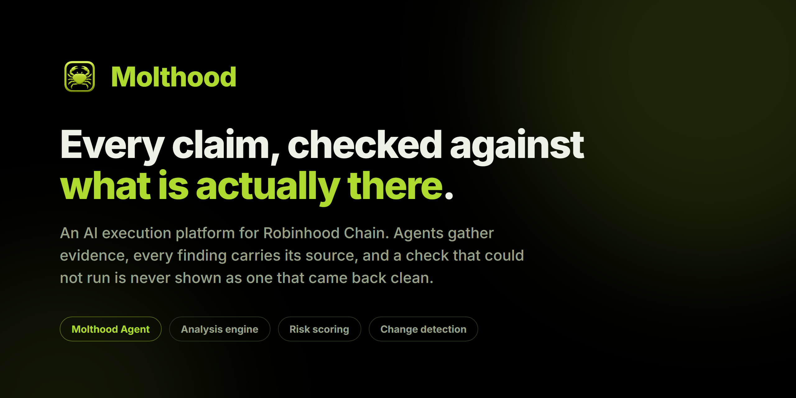
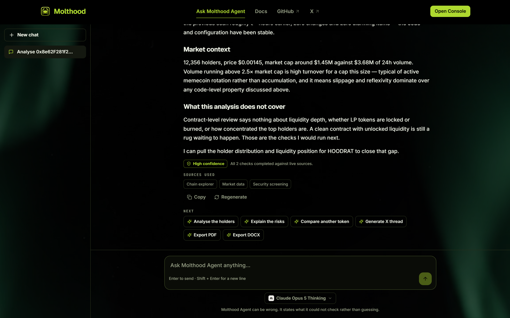
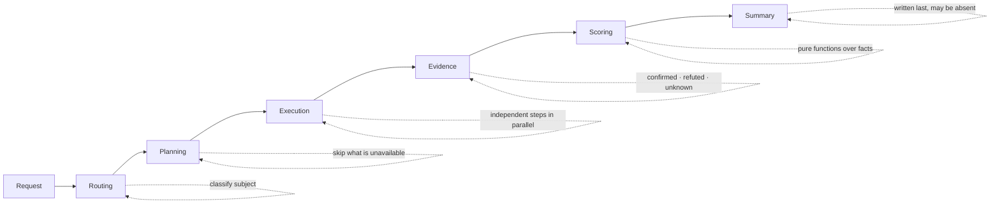
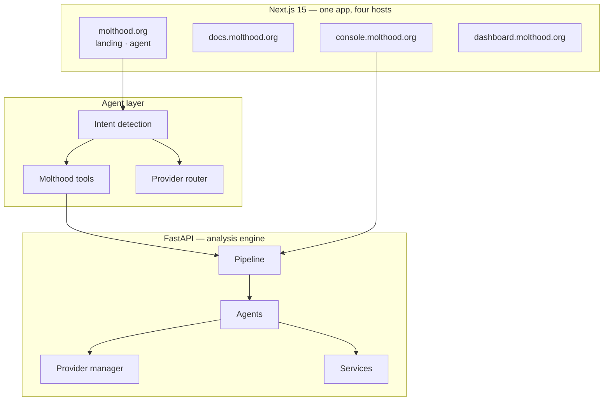

<div align="center">



**An AI execution platform for Robinhood Chain.**

You describe a subject — a token, a wallet, a contract, a website — and agents
gather evidence about it from independent sources, then report what they found
*and what they could not check*.

[](https://github.com/molthood/molthood/actions/workflows/gate.yml)
[](LICENSE)
[](https://nextjs.org)
[](https://fastapi.tiangolo.com)
[](https://www.typescriptlang.org)
[](https://www.python.org)

[molthood.org](https://molthood.org) ·
[Ask Molthood Agent](https://molthood.org/askmoltagent) ·
[Console](https://console.molthood.org) ·
[Documentation](https://docs.molthood.org) ·
[Roadmap](https://docs.molthood.org/roadmap)

</div>

---

## Contents

- [The rule everything is built around](#the-rule-everything-is-built-around)
- [Molthood Agent](#molthood-agent)
- [How an analysis works](#how-an-analysis-works)
- [Architecture](#architecture)
- [Repository layout](#repository-layout)
- [Running it locally](#running-it-locally)
- [Commands](#commands)
- [Design decisions worth knowing](#design-decisions-worth-knowing)
- [Security and privacy](#security-and-privacy)
- [Deployment](#deployment)
- [Roadmap](#roadmap)
- [FAQ](#faq)
- [Contributing](#contributing)
- [License](#license)

---

## The rule everything is built around

Most on-chain tooling will tell you a token is safe. Almost none of it
distinguishes between **checked and clean** and **not checked at all** — and
those two produce identical-looking green ticks.

That is not a small omission. It inverts the meaning of the result. A scanner
that could not reach the contract source, could not read the liquidity and
could not resolve ownership will happily show a page with no warnings on it,
and no warnings reads as good news.

> [!IMPORTANT]
> **A check that could not run must never render as a check that came back
> clean.**

Every finding is `confirmed`, `refuted`, or `unknown`. There is no fourth
state, and `unknown` is never rounded down to nothing.

| Situation | What most tools do | What Molthood does |
| --- | --- | --- |
| A source is unreachable | Omits the check | Reports it as `unknown`, with the reason |
| A risk check could not run | Scores as if it passed | Reports the score as a **ceiling** |
| A comparison has no baseline | "No changes" | Returns nothing, and says why |
| A page has no live data | Shows a plausible placeholder | Says it has no source |
| An explorer returns an empty field | Treats it as "no data" | Decides what the emptiness *means* |

That last row is the subtle one, and it is where this keeps breaking. An
explorer answering `200 OK` with an empty verification field is not saying
"unknown" — it is saying the contract is unverified, which is a finding.
Reading that emptiness as absence once let an unverified token score
identically to a verified one.

---

## Molthood Agent



Conversational access to the whole engine. You ask in a sentence; it works out
what needs checking, checks it, and tells you plainly what it could not
establish.

**It routes itself.** A 42-character hex string is an address, 66 characters is
a transaction, a `github.com` link is a repository. None of that needs a
language model, so it is decided in code — instantly, identically, every time.
What is deliberately *not* decided that way is whether an address is a token, a
wallet or a contract: that cannot be known without looking it up, and guessing
from the shape returns the wrong report about half the time.

**It shows its work.** A plan appears before anything slow starts, and is then
replaced by what the engine actually ran — `Read market, liquidity and holders`,
`Ran security checks`. Only completed steps earn a tick. A skipped step stays
visible as a step that did not happen.

**It cites what it used.** Sources are listed by the role they played, each
carrying the link that makes the claim checkable independently.

**It produces files.** Markdown, PDF, Word, Excel, PowerPoint, CSV, JSON, HTML,
SVG and Mermaid. A file opens in a workspace — preview, edit, copy, download —
rather than landing unread in a downloads folder.

**It answers about Molthood from Molthood.** Questions about the product are
answered from this repository's own documentation and roadmap, not from model
memory. A confident description of a roadmap that does not exist is the one
failure a product like this cannot afford.

### Models

One Agent, several models. The selector remembers your choice, and switching
mid-conversation keeps the subject and the history intact.

| Model | Provider | Best for |
| --- | --- | --- |
| Claude Opus 5 Thinking | Anthropic | Deep crypto research |
| Claude Sonnet 5 | Anthropic | Fast coding and daily conversations |
| GPT-5 | OpenAI | General intelligence and coding |
| Gemini 2.5 Pro | Google | Long documents and multimodal reasoning |
| DeepSeek Reasoner | DeepSeek | Coding and reasoning at lower cost |

You choose a **model**; Molthood chooses how to reach it. Each model declares an
ordered list of routes and the first healthy one answers, so a provider running
out of quota costs you that provider rather than the conversation.

The one thing the fallback will not do is restart an answer that has already
begun streaming. Retrying mid-sentence would make the text contradict itself,
which is worse than the failure it was avoiding.

---

## How an analysis works



| Stage | What happens |
| --- | --- |
| **Routing** | The request is classified. A hex string is an address; free text is read to work out what kind of subject it names. |
| **Planning** | A workflow is resolved against what is actually available. A step whose source is unreachable is skipped **and recorded as skipped**. |
| **Execution** | Independent steps run together, dependent ones after. A failing step does not fail the task; it produces an `unknown`. |
| **Evidence** | Each observation is stored with its source URL and its state. Never AI-generated. |
| **Scoring** | Pure functions over the collected facts. The same rules judge a token analysed alone and one screened inside a portfolio. |
| **Summary** | Written last, over findings that already exist. It can be absent — and say so — without invalidating anything above it. |

A report's confidence is **derived from what actually ran** rather than
asserted. When nothing could be established it is reported as `unknown` rather
than `low`, because "low" implies a weak answer and there was no answer.

---

## Architecture



Host-based routing means one deployment serves four surfaces. `src/middleware.ts`
holds a table of hosts and the internal segment each maps to; adding a surface
is one entry in it.

### Two integration layers, and why

`backend/app/services/` and `backend/app/providers/` look alike and are not
interchangeable.

- A **service** is a named dependency with a shape only it has. The chain
  explorer returns token records; nothing else does. Callers name the service.
- A **provider** is *interchangeable*. Several answer `WEB_SEARCH`, and the
  caller names the **capability** — the manager picks who serves it.

That is why providers declare capabilities rather than methods, and why a
provider that cannot serve a request returns a failed result instead of
raising. A router driving four providers must lose one to a missing key without
losing the run.

> [!NOTE]
> **The application is fully functional with zero credentials.** It starts,
> `/api/health` names every variable that would enable something, and the
> router routes around what is absent. Adding a key and restarting is the only
> enablement step — there is no code path that a new key switches on.

---

## Repository layout

```
.
├── src/                        Next.js 15 — site, docs, console, agent
│   ├── app/
│   │   ├── (site)/             landing + documentation
│   │   ├── askmoltagent/       Molthood Agent
│   │   ├── console/            application shell
│   │   ├── dashboard/          developer platform (behind a flag)
│   │   └── api/agent/          the one endpoint the browser talks to
│   ├── components/             ui · layout · console · marketing · ai · docs
│   ├── config/                 content as data — docs, roadmap, models
│   ├── lib/ai/
│   │   ├── intent.ts           deterministic request classification
│   │   ├── tools.ts            what the agent may call
│   │   ├── knowledge.ts        Molthood's own docs, searchable
│   │   ├── artifacts.ts        text in, real files out
│   │   └── providers/          registry · health · routing · streaming
│   └── middleware.ts           host-based routing for four surfaces
│
└── backend/
    └── app/
        ├── agents/             market · risk · research · portfolio
        ├── engine/             pipeline, evidence, scoring, diffing
        ├── providers/          interchangeable capabilities + orchestrator
        ├── services/           named dependencies + shared HTTP
        ├── repositories/       persistence, API keys, allowances
        └── api/v1/             the public surface
```

Both apps have a guide written to be read *before* changing anything:
[`AGENTS.md`](AGENTS.md) for the frontend and the shared rules, and
[`backend/README.md`](backend/README.md) for the engine. They explain why
things are the way they are, rather than restating what the code already says.

---

## Running it locally

**Requirements** — Node 20+, Python 3.12+.

```bash
# 1. the analysis engine — http://127.0.0.1:8000
cd backend
python -m venv .venv && source .venv/bin/activate   # Windows: .venv\Scripts\activate
pip install -r requirements.txt
cp .env.example .env
uvicorn app.main:app --reload

# 2. the web application — http://localhost:3000
npm install
cp .env.example .env.local
npm run dev
```

`NEXT_PUBLIC_API_URL` in `.env.local` points the web app at the engine.

Nothing else is required to start. Analyses need an API key because they cost
real inference credit — create one against your local engine:

```bash
curl -X POST http://127.0.0.1:8000/api/v1/keys \
  -H "Content-Type: application/json" \
  -d '{"label":"local"}'
```

Then run one:

```bash
curl http://127.0.0.1:8000/api/v1/token/0x… \
  -H "Authorization: Bearer mk_…"
```

The response carries `facts`, `evidence` with a source URL per item, `stages`,
and the tasks that ran. Full reference at
[docs.molthood.org/api](https://docs.molthood.org/api).

---

## Commands

| | Frontend | Backend |
| --- | --- | --- |
| Develop | `npm run dev` | `uvicorn app.main:app --reload` |
| Types | `npm run typecheck` | `mypy app` |
| Lint | `npm run lint` | `ruff check app tests` |
| Format | — | `ruff format app tests` |
| Test | — | `pytest` |
| Build | `npm run build` | — |

CI runs all of it on every push and pull request. Both hosts deploy from `main`
automatically, so a red gate is the only thing standing between a bad commit
and production.

> [!WARNING]
> `ruff check` and `ruff format --check` are different tools with the same
> prefix. Running only the first is the usual way a red build reaches CI.

---

## Design decisions worth knowing

<details>
<summary><b>Routing policy is data, not code</b></summary>

<br>

Provider preference lives in a table, and its order encodes cost as well as
ability — a provider that reads a page for free precedes one that renders it in
a browser and bills for it. Adding a provider is one entry there; adding a
workflow is one entry in the workflow table.

</details>

<details>
<summary><b>Availability is six states, not a boolean</b></summary>

<br>

`missing_key` is a deployment task, `rate_limited` clears on its own, and
`unavailable` is an upstream outage. Collapsing them repeats exactly the
mistake the evidence model exists to prevent — and a health probe that only
checks reachability will report green for a provider that answers its catalogue
and refuses every completion.

</details>

<details>
<summary><b>Two separate limits, for two different reasons</b></summary>

<br>

Rate limiting caps **pace** and is in-process, per-process, lost on restart —
which is fine, it protects the server from a burst. Allowances cap **spend**
and live in the database, because they guard money and must hold across
restarts and workers. The increment is a single guarded `UPDATE`, never a
read-then-write; the latter is safe only because SQLite serialises writers, and
silently overspends on PostgreSQL.

</details>

<details>
<summary><b>Monitoring is off by default</b></summary>

<br>

A monitor that started itself would begin spending every existing key's quota
the moment a new version deployed. A scheduled check spends the owner's
allowance exactly as a manual run does, and a failed check still records
`last_checked_at` — otherwise the watch stays permanently due and retries in a
tight loop against whatever is already broken.

</details>

<details>
<summary><b>Suppliers are named by role, never by brand</b></summary>

<br>

Findings cite "Chain explorer", "Market data", "Security screening" — and carry
the link, which is what actually makes a claim checkable. Redaction happens at
the one response boundary every analysis passes through, rather than in each
consumer, because doing it per-consumer is how the raw execution response ended
up as the one path nobody covered. URLs are deliberately left intact: rewriting
a hostname produces a link that no longer resolves.

</details>

<details>
<summary><b>Decorative elements never depend on JavaScript</b></summary>

<br>

A section divider once shipped completely invisible: it was wrapped in a motion
component whose initial state was `opacity: 0`, and the entrance never ran. It
was present in the DOM and invisible on the page — the hardest kind of failure
to notice, because it looks like nothing happened at all. Decoration is CSS
first; animation may only ever enhance something already visible.

</details>

---

## Security and privacy

Molthood is **read-only**. It reads public chain state and public web pages. It
has no custody, signs nothing, submits no transactions, and there is no wallet
connection anywhere in the product.

> [!CAUTION]
> Nobody from Molthood will ever ask for a seed phrase or a private key. There
> is no feature that could use one.

- **Analyses are private by default.** Every execution records the key that ran
  it, and history, permalinks, caching and change detection are all scoped to
  that key. A run becomes visible to others only if its owner publishes it.
- **Agent conversations stay in your browser.** There is no account system yet,
  and keeping them server-side without one would mean either a shared list
  anyone could read or an identity nobody asked to create.
- **Keys are stored hashed** and shown once. Provider credentials are read
  server-side only; no key that costs money reaches a browser.
- **Analytics cannot carry content.** The event schema records which surfaces
  are used and whether requests succeed — shape, not substance.

Reporting a vulnerability: [`SECURITY.md`](SECURITY.md).

---

## Deployment

The web application deploys to Vercel, the engine to Railway, and the two meet
in exactly two places: `NEXT_PUBLIC_API_URL` on the web side and `CORS_ORIGINS`
on the engine side. [`DEPLOY.md`](DEPLOY.md) covers the whole path, including
the handful of settings whose value differs in production.

---

## Roadmap

Grouped by proximity rather than by date — a date given at this stage is a
promise made with the least information anyone will ever have about the work.

| Phase | Contains |
| --- | --- |
| **Shipped** | Analysis engine · Console · Molthood Agent · Change detection |
| **Current** | Public API · API keys |
| **Next** | Webhooks · Notifications · SDK |
| **Planned** | CLI · MCP support · Skills · Portfolio · Smart alerts |
| **Future** | Wallet intelligence · Agent marketplace · Strategy builder · Mobile · Browser extension |

Every entry carries a description and the reason it is worth building, at
[docs.molthood.org/roadmap](https://docs.molthood.org/roadmap). Anything below
**Shipped** does not exist yet and is labelled that way everywhere it appears.

---

## FAQ

<details>
<summary><b>Which chain does this support?</b></summary>

<br>

On-chain analysis is scoped to Robinhood Chain (EVM, chain ID `4663`). Depth
over breadth: reliable analysis depends on knowing which explorer indexes what
and how a specific network behaves, and spreading that across a dozen chains
produces a tool that is shallow everywhere.

Off-chain work — website research, documentation analysis, general questions —
is not chain-scoped.

</details>

<details>
<summary><b>Is a clean report an endorsement?</b></summary>

<br>

No. It is the absence of the specific problems Molthood knows how to look for.
Read the unknowns before the findings: a report with two findings and nine
unknowns is not reassuring, however good the two look.

</details>

<details>
<summary><b>Why is the developer platform hidden?</b></summary>

<br>

It is being built. An interface that does not work yet costs a visitor a click
to discover, and every disabled button is a small claim that something exists.
Nothing was deleted — the gate is one check on a layout, and every page below
it still compiles with the rest of the product. See the
[status page](https://docs.molthood.org/platform/dashboard).

</details>

<details>
<summary><b>Does it give financial advice?</b></summary>

<br>

No. It explains mechanics, risks, and how to verify something yourself. It does
not predict prices and does not tell you what to buy.

</details>

---

## Contributing

[`CONTRIBUTING.md`](CONTRIBUTING.md) covers the workflow. The short version:
read the guide for the area you are touching, keep the evidence model intact,
and add a test for anything that could silently become wrong.

Security issues go to [`SECURITY.md`](SECURITY.md) — privately, please, rather
than as a public issue.

---

## License

[Apache 2.0](LICENSE). Use it, change it, ship it — keep the notice, state what
you changed, and the patent grant travels with the code.

---

<div align="center">
<sub>Built for Robinhood Chain.</sub>
</div>
